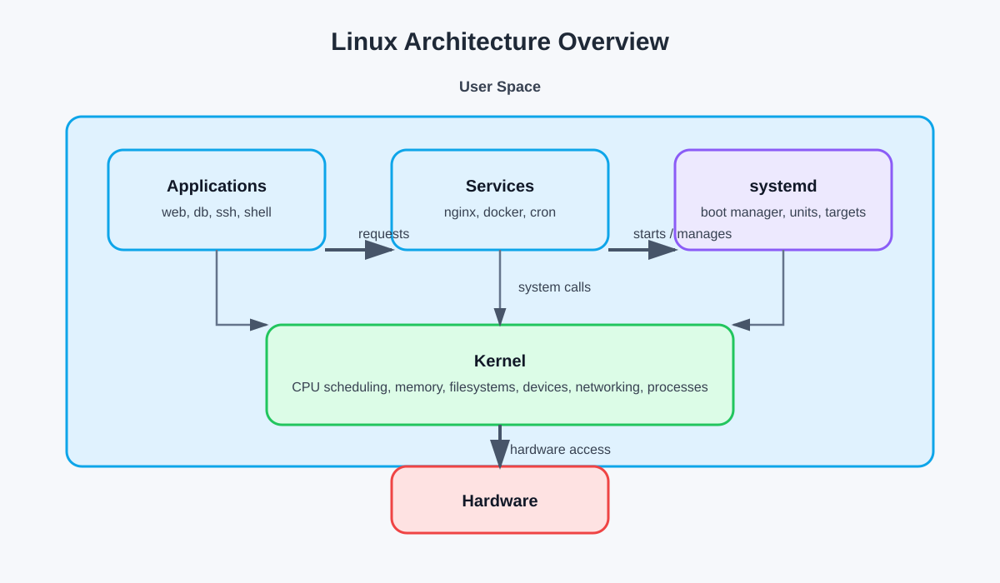
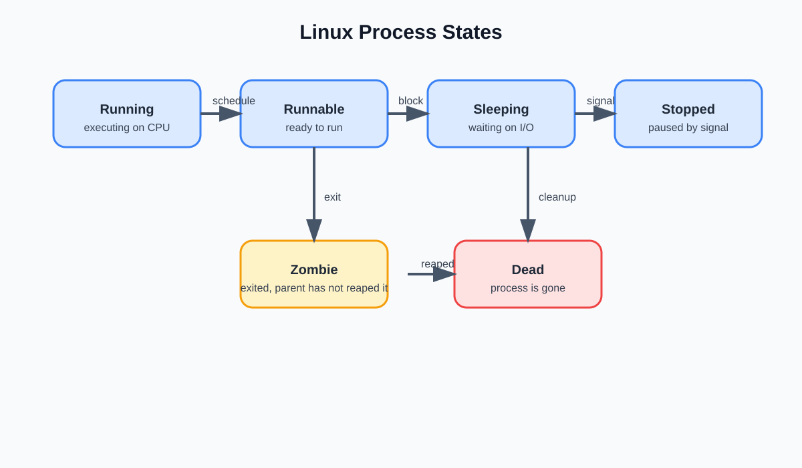

# Linux Architecture, Processes, and systemd

## 1) Core components of Linux

Linux is usually described as two major layers:

- Kernel: the core of the OS. It controls CPU scheduling, memory, file systems, devices, networking, and process management. It runs in privileged mode and decides what user programs can do.
- User space: everything above the kernel — applications, shell commands, services, and daemons. Programs do not talk directly to hardware; they ask the kernel through system calls.
- init / systemd: the first real userspace manager after boot. It starts services, manages dependencies, keeps the machine in a known state, and brings up networking, SSH, logging, and other services.

A simple mental model:

- Bootloader loads the kernel
- Kernel initializes hardware and mounts the root filesystem
- systemd starts required services and targets
- Shell and apps run in user space

Quick commands to check the basics:

- `uname -a` — show kernel version and machine details
- `cat /etc/os-release` — see distro details
- `ps -ef --forest` — view running processes in a tree
- `systemctl --version` — confirm whether systemd is installed
- `ls /proc/1/status` — check the init/systemd process details

## 2) How processes are created and managed

A process is a running instance of a program. Each process has:

- PID: unique process ID
- PPID: parent process ID
- state: what it is doing now
- memory, CPU, and open files

Creation flow:

- A process creates a child with `fork()`
- The child may replace its memory with a new program using `exec()`
- The OS tracks all processes in a process tree
- The kernel scheduler decides which runnable process gets CPU time

This is the basic lifecycle:

- Parent starts child
- Child runs its own code
- Parent may wait for it or continue independently
- When a child exits, the kernel keeps a short-lived entry until the parent reaps it; this is a zombie state

### Common process states

- Running: actively executing on CPU
- Runnable: ready to run, waiting for CPU time
- Sleeping: blocked waiting for I/O, signal, or resource
- Stopped: paused, usually by a signal
- Zombie: process has exited but parent has not reaped its status
- Defunct: old term for zombie; still waiting cleanup

Useful commands:

- `ps -eo pid,ppid,stat,comm --forest` — show process tree and state
- `top` — live view of CPU and memory usage
- `htop` — interactive process monitor (if installed)
- `pstree -ap` — see parent-child relationships clearly
- `kill -STOP <pid>` and `kill -CONT <pid>` — pause and resume a process manually

## 3) What systemd does

`systemd` is the init system and service manager on most modern Linux distributions.

It is responsible for:

- Starting services during boot
- Managing service states: start, stop, restart, reload
- Handling dependencies between services
- Starting services in parallel for faster boot
- Managing targets like multi-user mode, graphical mode, rescue mode
- Collecting logs via the journal
- Keeping systems consistent after crashes or reboots

Examples:

- `systemctl start nginx`
- `systemctl status ssh`
- `systemctl restart docker`
- `systemctl enable nginx`

Why it matters:

- It gives a consistent way to manage services
- It helps with troubleshooting and automation
- It makes boot order, restarts, and dependency handling predictable

Commands to check systemd and services:

- `systemctl status nginx` — see if a service is active, failed, or stuck
- `systemctl list-units --type=service --state=running` — list running services
- `systemctl is-enabled ssh` — check whether a service starts on boot
- `systemctl restart nginx` — restart a service
- `journalctl -u nginx -n 50 --no-pager` — read recent service logs
- `systemctl cat nginx` — inspect the unit file for configuration

## 4) 5 commands you will use daily

1. `ps aux` — see running processes and their owners
2. `top` or `htop` — check CPU, memory, and process activity live
3. `systemctl status <service>` — inspect a service and its state
4. `journalctl -u <service> -n 50 --no-pager` — read recent logs for one service
5. `free -h` or `df -h` — check memory and disk usage quickly

## 5) Quick DevOps mindset

When troubleshooting, use these checks in order:

- `ps aux | grep <process>` — find the process
- `top` or `htop` — check if it is using too much CPU or memory
- `systemctl status <service>` — see if the service is active or failed
- `journalctl -u <service> -n 50 --no-pager` — read the recent logs
- `df -h` and `free -h` — confirm disk and memory are not exhausted

When something is wrong on Linux, think in this order:

- Which process is failing?
- Is it running, sleeping, or stuck?
- Is the service started by systemd?
- What do the logs say?
- Is CPU, memory, or disk saturated?

This is the foundation for troubleshooting production systems.

## Summary

Linux is a kernel-driven system with user-space applications above it. Processes are created and managed by the kernel, while `systemd` handles boot and service lifecycle. Understanding these basics makes debugging service failures, resource issues, and startup problems much easier in real DevOps work.
